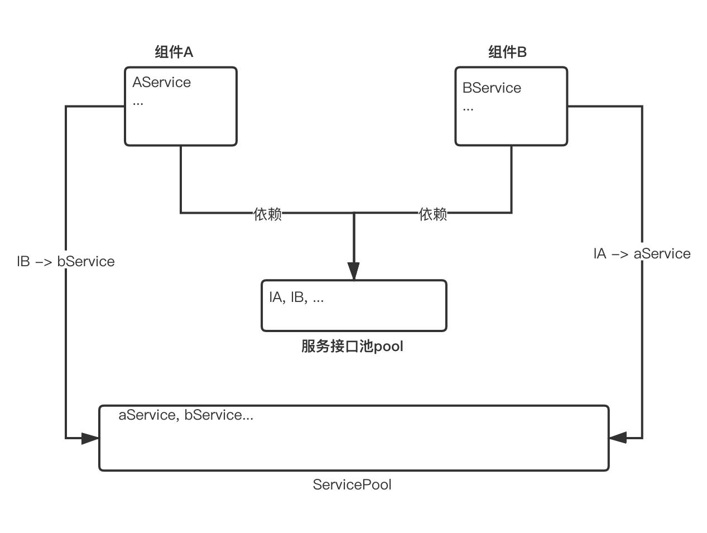
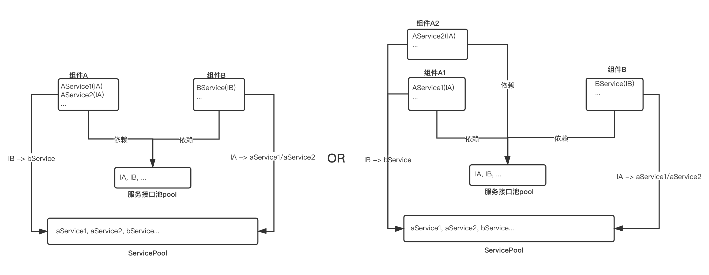

组件化开发过程中，随着组件越来越多，组件的之前的交互就会变得非常的复杂，此时组件间通信变得尤其的重要，ServicePool就是为组件化而生，用最简单的方式进行组件间通信。使用依赖注入，按需灵活注入组件。同时支持组件热插拔，达到组件即插即用的效果。可配置组件生命周期，做到组件按需创建和及时回收，充分利用懒加载的思想，有效解决组件初始化耗时导致的app启动速度问题。


### ServicePool接入方法

在项目根目录的build.gradle中引入 

```
allprojects {
    repositories {
        ...
        maven { url "http://47.99.188.223:8081/repository/maven-public/"}
    }
}
```

和
 
```
buildscript {

    repositories {
        ...
        maven { url "http://47.99.188.223:8081/repository/maven-public/"}
    }
    dependencies {
        ...
        classpath 'chao.android.gradle:autoservice:1.1.0'
    }
}
```

在主Module目录(一般是app目录)的build.gradle中添加 

```
apply plugin: 'sp.autoservice'

...
```

其他Module下按需添加依赖
```
dependencies {
    implementation 'chao.java.tools:servicepool:1.1.0' //servicepool核心库, 是java库
    implementation 'chao.java.tools:servicepool-android:1.1.0' // servicepool的Android支持
}
```

### ServicePool使用方式

#### 在Application的onCreate()/onAttachBaseContext()方法中初始化 
ServicePool使用懒加载思想,所有服务Service对象都是在真正使用的时刻才会去创建和初始化。这里主要是因为Android部分功能依赖Context，
初始化时可注入ApplicationContext。还有有些特定的服务有预加载的需求(如业务组件可能需要一个特定的初始化场景，而不是去依赖Application的onCreate()方法)

```
   AndroidServicePool.init(this);
```

### ServicePool基础能力

<!---->
<div align="center"> 
    
</div>

如上图所示:
1. 组件A,B是两个互不依赖的组件，A,B不能直接通信
2. 组件A,B分别通过AService, BService对外提供服务
3. 组件A,B的接口协议存放在组件服务池pool, 分别是接口IA, IB
4. 当组件B需要组件A的服务时，组件B使用IA接口向ServicePool申请,
   由ServicePool创建并返回aService给组件B, 此时组件b可以使用aService的服务了
5. 同理， 组件A使用IB向ServicePool申请bService
6. aService,bService由ServicePool创建和管理
7. 所有Service对象的优先级生命周期可以通过@Service注解配置


```
/**
 * 服务池pool中
 *
 * IA.java
 */
public interface IA {
    void aName();
}


/**
 * 服务池pool
 *
 * IB.java
 */
public interface IB {
    void bName();
}
```

```
/**
 * 组件A
 *
 * AService.java
 */
@Service
public class AService implements IA {

    @Override
    public String aName() {
        return "A Service";
    }
}
```

```
/**
 * 组件B
 * 
 * BService.java
 */
@Service
public class BService implements IB {

    @Override
    public String bName() {
        return "B Service";
    }
}
```


```
组件A中执行:
   IB b = ServicePool.getService(IB.class);
   System.out.println("I'm A Service, I can get " + b.bName());

输出: 
  I'm A Service, I can get B Service


组件B中执行:
  IA a = ServicePool.getService(IA.class);
  System.out.println("I'm B Service, I can get " + a.aName());

输出:
  I'm B Service, I can get A Service
```


### 支持通过path查找Service

```

/**
 * 服务池pool中
 * 
 * IPathService.java
 */
public interface IPathService {
    String pathServiceName();
}

```

```
/**
 * 组件A中
 * 
 * PathService
 */
@Service(path = "pathService")
public class PathService implements IPathService {
    @Override
    public String pathServiceName() {
        return "Path Service";
    }
}
```

```
组件B中执行:
    IPathService pathService = ServicePool.getService(IPathService.class);
    System.out.println(pathService.pathServiceName());

输出:
    Path Service
```

#### 典型应用场景: 
1. activity路由
2. 混合开发中,可以通过path将桥接方法分发到对应执行器


### 指定Service优先级，按优先级顺序返回
<div align="center">

</div> 

如果IA有多个实现,如上图所示,ServicePool会比较每个实现优先级，来决定最终返回IA的哪个实现
1. @Service注解标记一个实现类时候可以通过参数priority指定这个实现类的优先级
2. 优先级值越大优先级越高， ServicePool默认会返回优先级最高的实现类对象
3. 如果多个实现类优先级相同，那么返回会有不确定性
4. 也可以直接指定具体使用哪个实现类，如ServicePool.getService(AService1.class)将会返回一个AService1对象


```
/**
 * 服务池pool中
 * 
 * IPriorityService.java
 */
public interface IPriorityService {
    int getPriority();
}
```

```
/**
 * 组件A中
 * 
 * PriorityService1.java
 * PriorityService2.java
 */
@Service(priority = 1)
public class PriorityService1 implements IPriorityService {
    @Override
    public int getPriority() {
        return 1;
    }
}

@Service(priority = 1)
public class PriorityService2 implements IPriorityService {
    @Override
    public int getPriority() {
        return 2;
    }
}
```

```
组件B中执行:
    IPriorityService priorityService = ServicePool.getService(IPriorityService.class);
    System.out.println("priority is " + priorityService.getPriority());
    
    priorityService = ServicePool.getService(PriorityService1.class);
    System.out.println("priority is " + priorityService.getPriority());
    
    priorityService = ServicePool.getService(PriorityService2.class);
    System.out.println("priority is " + priorityService.getPriority());
    
输出:
   priority is 2
   priority is 1
   priority is 2
```

#### 典型应用场景
1. Java Library组件和Android Library组件使用不同的服务, 如classloader等等。
2. debug环境,release环境或者不同的productFlavor使用不同的服务, 如logger,
   Mock等等
3. 不同的业务场景使用不同的服务

### 给服务对象指定生命周期
每个由ServicePool创建的service对象都有各自生命周期，service对象的生命周期由ServicePool管理,
并由@Service注解配置生命周期类型。
1. Service有once, temp, global三种生命周期类型. 
2. 指定Service的生命周期为once,@Service(scope=IService.Scope.once),每次ServicePool.getService()都会创建一个新的对象,对象使用后随gc自动被回收,
   scope默认为once
3. 指定Service的生命周期为temp,@Service(scope=IService.Scope.temp),Service由WeakReference缓存，只适用无状态服务。
4. 指定Service的生命周期为global,@Service(scope=IService.Scope.global),每次ServicePool.getService()拿到的都是同一个对象,App运行期间不会被回收

```
组件A中
/**
 * 
 * OnceService.java
 */
@Service(scope = IService.Scope.once)
public class OnceService implements LifecycleService {
}


/**
 * 
 * TempService.java
 */
@Service(scope = IService.Scope.temp)
public class TempService implements LifecycleService {
}


/**
 * 
 * GlobalService.java
 */
@Service(scope = IService.Scope.global)
public class GlobalService implements LifecycleService {
}
```

```
组件B中执行:
    System.out.println(ServicePool.getService(OnceService.class) == ServicePool.getService(OnceService.class));
    //System.out.println(ServicePool.getService(TempService.class) == ServicePool.getService(TempService.class));//不可靠
    System.out.println(ServicePool.getService(GlobalService.class) == ServicePool.getService(GlobalService.class));

输出:
    false
    true
```


### 组件懒加载机制 & 禁用懒加载

### Activity路由

### 依赖注入


 
